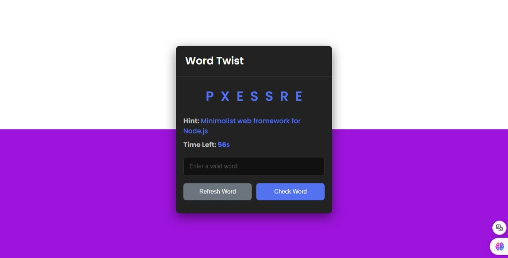

# Simple_Js_Tasks-5
## Word Twist Game

## Overview
Word Twist is a fun and challenging word game where players unscramble words based on hints provided. Test your vocabulary and speed in this exciting game!

## Features
- **Word Scrambling:** A random word is chosen from a list and displayed in a scrambled format.
- **Hints:** Each word comes with a hint to help you unscramble it.
- **Timer:** Players have 60 seconds to guess the correct word.
- **Input Validation:** Ensures only valid words are accepted as answers.
- **Refresh Button:** Allows players to skip to the next word if stuck.
- **Feedback:** Provides immediate feedback on correct or incorrect guesses.
- **Responsive Design:** Optimized for various screen sizes and devices.

## Technologies Used
- HTML5
- CSS3 
- JavaScript (ES6)
- JSON file for data storage
- Custom API for fetching data from JSON

## Demo
You can Try out the game online **[ From_Here](https://eng-ahmed-hussien.github.io/Simple_Js_Tasks-5/)**.

## Usage
- Start the game by loading `index.html` in your browser.
- Try to unscramble the displayed word within the given time limit.
- Use the provided hint if needed.
- Click "Refresh Word" to skip to the next word.
- Enjoy challenging yourself with each new round!

## Contributing
Contributions are welcome! Please fork the repository and submit a pull request with your improvements.

## License
This project is licensed under the MIT License - see the LICENSE file for details.
